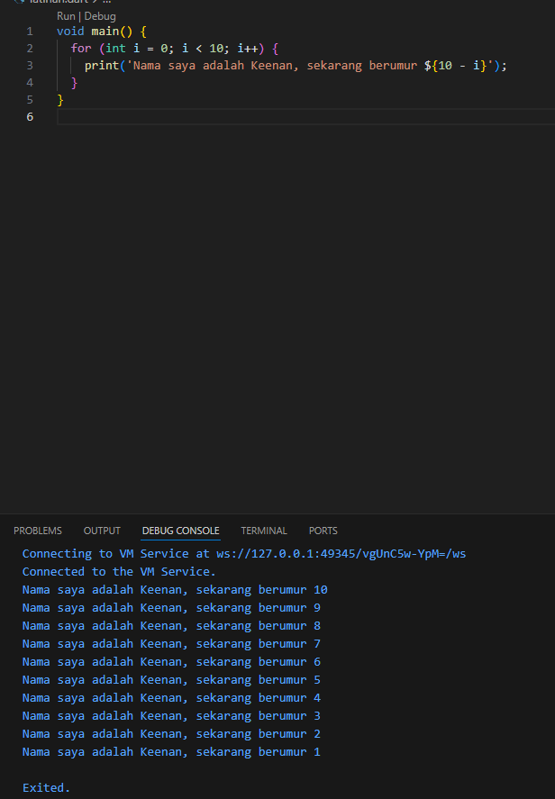

# Laporan Praktikum #01 - Pengantar Pemrograman Mobile

## Identitas Mahasiswa

| Atribut | Nilai                        |
| ------- | -----                        |
| Nama    | Keenan Aryasatya        |
| NIM     | 244107060124                 |
| Kelas   | SIB-2D                       |

---

## Tugas Praktikum 2

## Soal 1

Modifikasilah kode pada baris 3 di VS Code atau Editor Code favorit Anda berikut ini agar mendapatkan keluaran (output) sesuai yang diminta!

Jawab:
Berikut adalah hasil modifikasi kode program yang menghasilkan output sesuai dengan yang diminta

## Soal 2

Mengapa sangat penting untuk memahami bahasa pemrograman Dart sebelum kita menggunakan framework Flutter ? Jelaskan!

Jawab:
Dart sangat penting untuk memahami bahasa pemrograman sebelum menggunakan framework Flutter

## Soal 3

Rangkumlah materi dari codelab ini menjadi poin-poin penting yang dapat Anda gunakan untuk membantu proses pengembangan aplikasi mobile menggunakan framework Flutter.

Jawab:
* Dart adalah bahasa inti yang digunakan untuk membangun aplikasi dengan Flutter.
* Dart bersifat modern, object-oriented (OOP), dan type-safe.
* Mendukung garbage collection untuk manajemen memori otomatis.
* Memiliki dua mode eksekusi: JIT (untuk development & hot reload) dan AOT (untuk performa maksimal saat release).
* Bersifat cross-platform (bisa untuk mobile, web, dan desktop).
* Memiliki sintaks yang mirip dengan C/Java sehingga mudah dipelajari.
* Mendukung berbagai operator (aritmatika, logika, relasional) untuk pengolahan data.
* Setiap program Dart dimulai dari fungsi `main()`.
* Memahami Dart sangat penting untuk menjadi developer Flutter yang produktif.

## Soal 4

Buatlah penjelasan dan contoh eksekusi kode tentang perbedaan Null Safety dan Late variabel !

Jawab:

Null Safety (?)
Menjamin variabel tidak "kosong" (null) kecuali diizinkan secara eksplisit.

Late Variable (late)
Menunda pengisian nilai variabel, tapi berjanji akan mengisinya sebelum digunakan.

