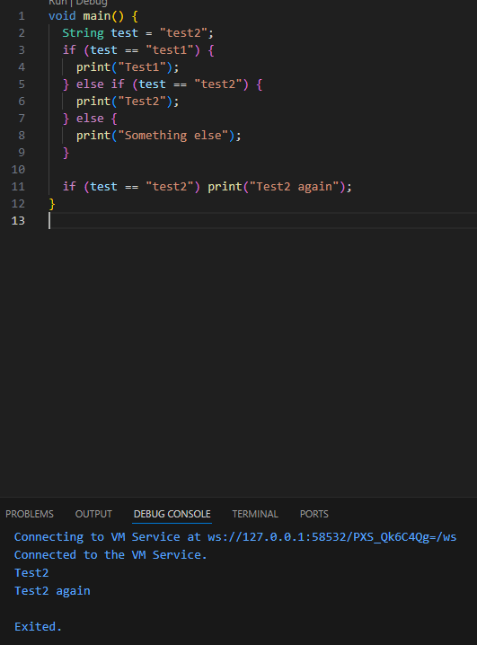
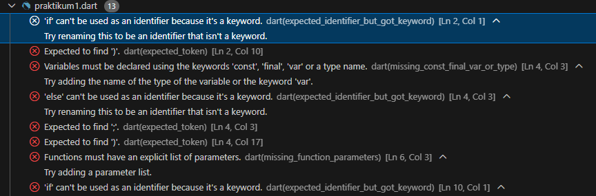
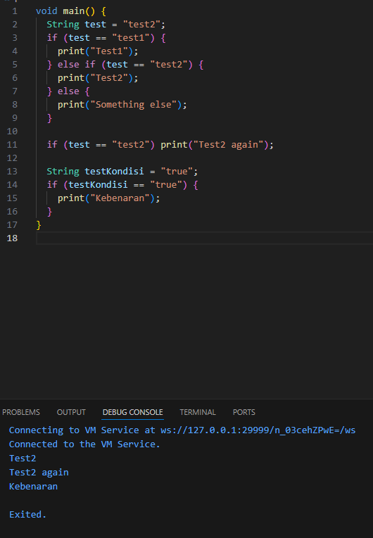
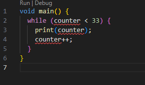
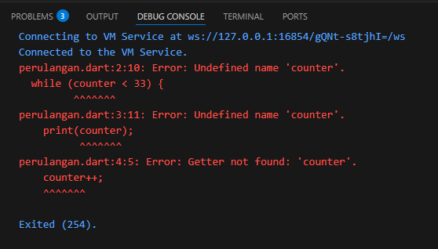
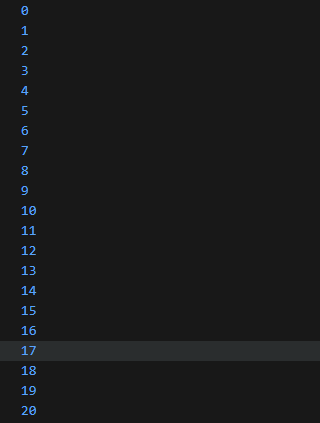
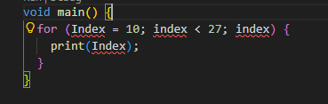
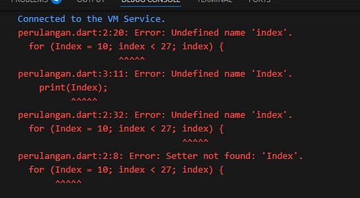
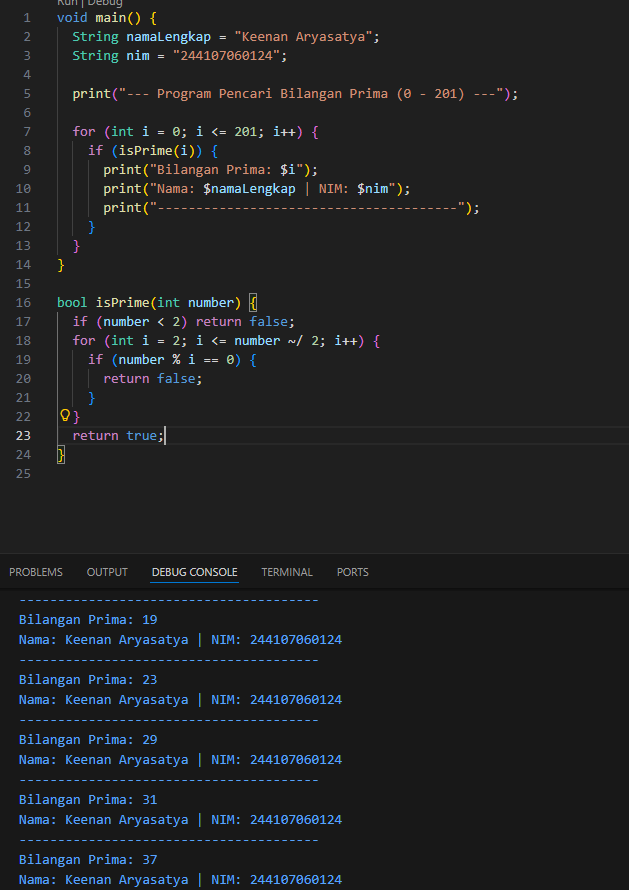

# Laporan Praktikum #01 - Pengantar Pemrograman Mobile

## Identitas Mahasiswa

| Atribut | Nilai                        |
| ------- | -----                        |
| Nama    | Keenan Aryasatya        |
| NIM     | 244107060124                 |
| Kelas   | SIB-2D                       |

---

## Tugas Praktikum 3

### Soal 1

1. Silakan selesaikan Praktikum 1 sampai 3, lalu dokumentasikan berupa screenshot hasil pekerjaan beserta penjelasannya!

Jawab:

#### - Praktikum 1 

- Langkah 1

Ketik atau salin kode program berikut ke dalam fungsi main().

- Langkah 2

Silakan coba eksekusi (Run) kode pada langkah 1 tersebut. Apa yang terjadi? Jelaskan!

* Jika mencoba menjalankan kode ini program tidak akan berjalan dan akan memunculkan pesan Error. 

- Langkah 3

Tambahkan kode program berikut, lalu coba eksekusi (Run) kode Anda.

#### - Praktikum 2

- Langkah 1

Ketik atau salin kode program berikut ke dalam fungsi main().

- Langkah 2

Silakan coba eksekusi (Run) kode pada langkah 1 tersebut. Apa yang terjadi? Jelaskan!

* Jika mencoba menjalankan kode ini program tidak akan berjalan dan akan memunculkan pesan Error. 

- Langkah 3

Tambahkan kode program berikut, lalu coba eksekusi (Run) kode Anda.

#### - Praktikum 3

- Langkah 1

Ketik atau salin kode program berikut ke dalam fungsi main().

- Langkah 2

Silakan coba eksekusi (Run) kode pada langkah 1 tersebut. Apa yang terjadi? Jelaskan!

* Jika mencoba menjalankan kode ini program tidak akan berjalan dan akan memunculkan pesan Error. 

- Langkah 3

Tambahkan kode program berikut di dalam for-loop, lalu coba eksekusi (Run) kode Anda.

#### - TUGAS PRAKTIKUM

- Buatlah sebuah program yang dapat menampilkan bilangan prima dari angka 0 sampai 201 menggunakan Dart. Ketika bilangan prima ditemukan, maka tampilkan nama lengkap dan NIM Anda.

