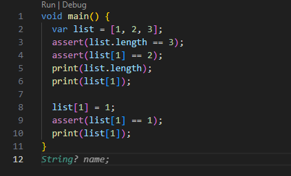
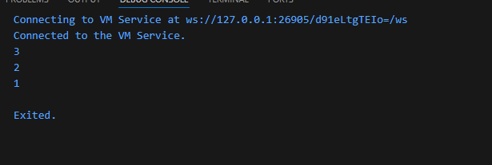
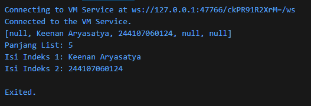

# Laporan Praktikum #04 - Pengantar Pemrograman Mobile

## Identitas Mahasiswa

| Atribut | Nilai                        |
| ------- | -----                        |
| Nama    | Keenan Aryasatya        |
| NIM     | 244107060124                 |
| Kelas   | SIB-2D                       |

---

## Tugas Praktikum 4

### Soal 1

1. Silakan selesaikan Praktikum 1 sampai 5, lalu dokumentasikan berupa screenshot hasil pekerjaan beserta penjelasannya!

Jawab:

#### - Praktikum 1 

- Langkah 1

Ketik atau salin kode program berikut ke dalam fungsi main().

- Langkah 2

Silakan coba eksekusi (Run) kode pada langkah 1 tersebut. Apa yang terjadi? Jelaskan!

- mencetak 3 karena ada tiga elemen dalam list

- Langkah 3

Ubah kode pada langkah 1 menjadi variabel final yang mempunyai index = 5 dengan default value = null. Isilah nama dan NIM Anda pada elemen index ke-1 dan ke-2. Lalu print dan capture hasilnya.

- Membuat list dengan ukuran tetap (fixed-length) sebanyak 5 elemen yang semuanya berisi null

#### - Praktikum 2

- Langkah 1

Ketik atau salin kode program berikut ke dalam fungsi main().

