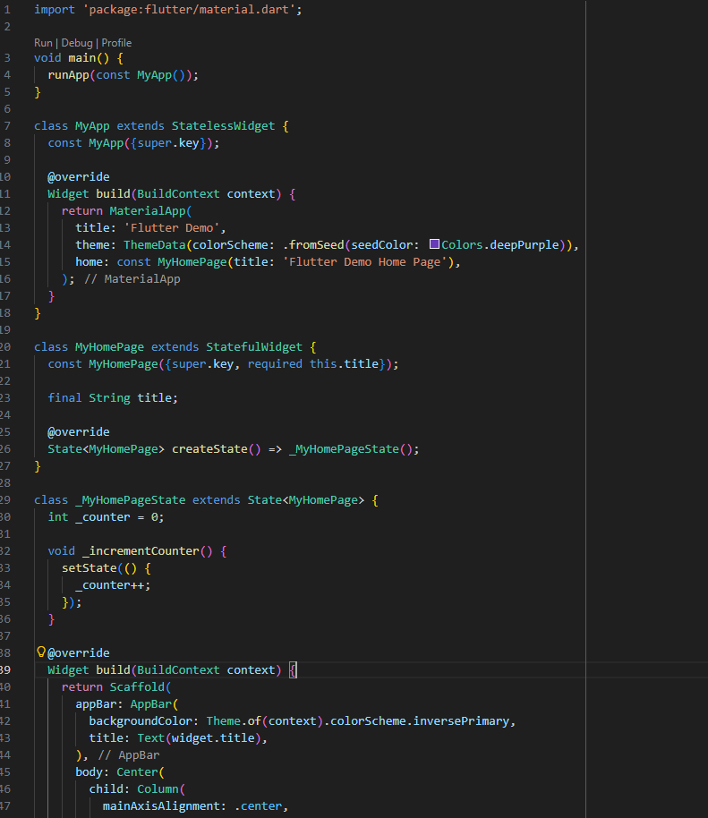

# Laporan Praktikum #05 - Pengantar Pemrograman Mobile

## Identitas Mahasiswa

| Atribut | Nilai                        |
| ------- | -----                        |
| Nama    | Keenan Aryasatya        |
| NIM     | 244107060124                 |
| Kelas   | SIB-2D                       |

---

## Tugas Praktikum 5

### Soal 1

1. Selesaikan Praktikum 1 sampai 5

Jawab:

#### - Praktikum 1 

- Langkah 1

Ketik atau salin kode program berikut ke dalam fungsi main().

